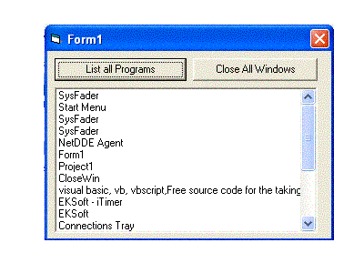



## Close All Window Application

### Description

This program will close all your windows application without getting its hwnd, with only one click
 
### More Info
 
you must control all the app to be closed

             |
---                |---
**Submitted On**   |2002-03-16 20:59:52
**By**             |[Elio](https://github.com/Planet-Source-Code/PSCIndex/blob/master/ByAuthor/elio.md)
**Level**          |Advanced
**User Rating**    |5.0 (10 globes from 2 users)
**Compatibility**  |VB 6\.0
**Category**       |[Windows API Call/ Explanation](https://github.com/Planet-Source-Code/PSCIndex/blob/master/ByCategory/windows-api-call-explanation__1-39.md)
**World**          |[Visual Basic](https://github.com/Planet-Source-Code/PSCIndex/blob/master/ByWorld/visual-basic.md)
**Archive File**   |[Close\_All\_627013162002\.zip](https://github.com/Planet-Source-Code/elio-close-all-window-application__1-32749/archive/master.zip)

